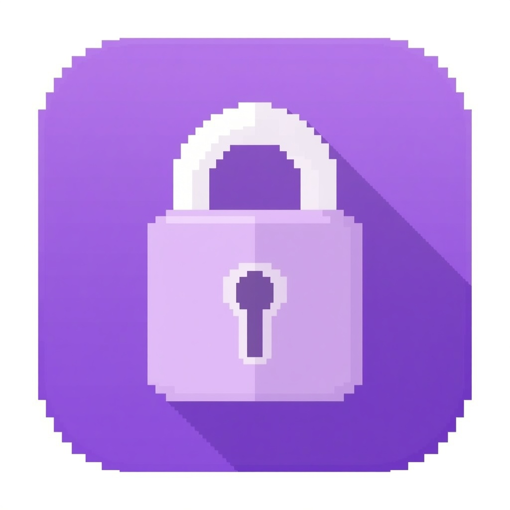
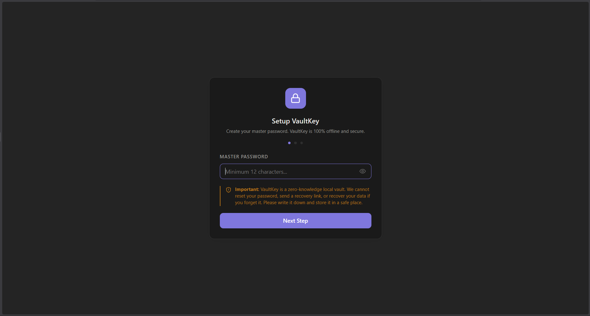
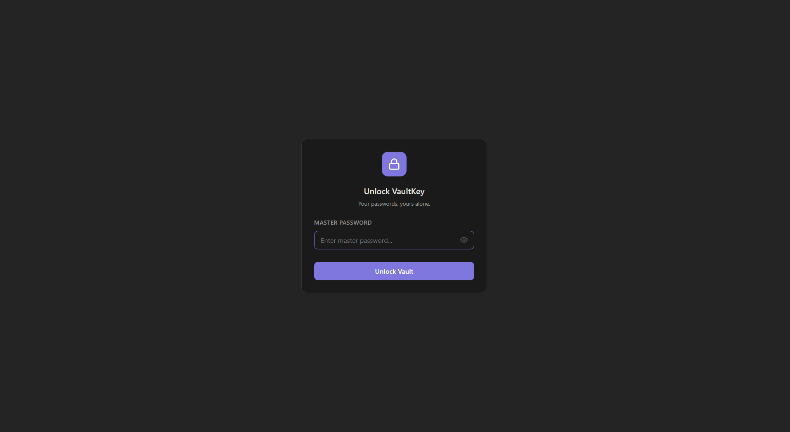
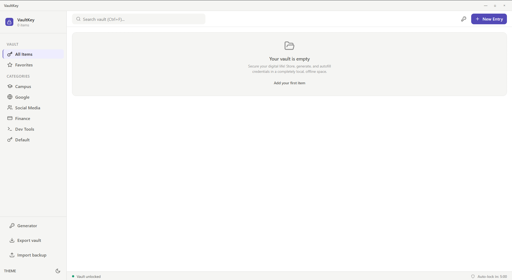
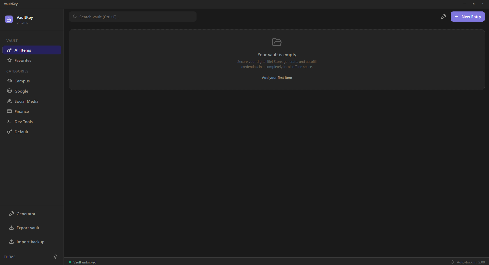
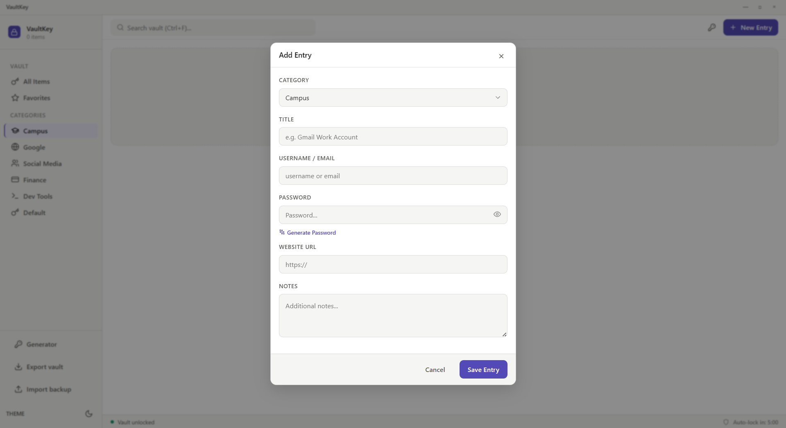
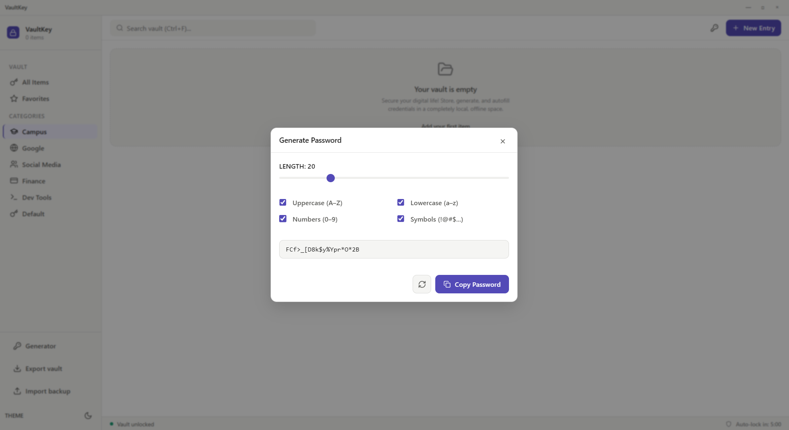
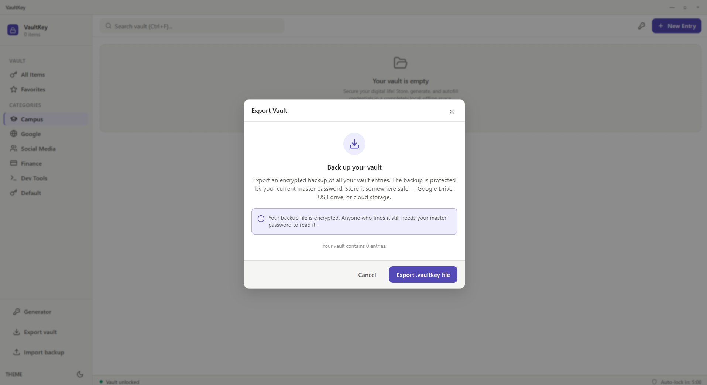
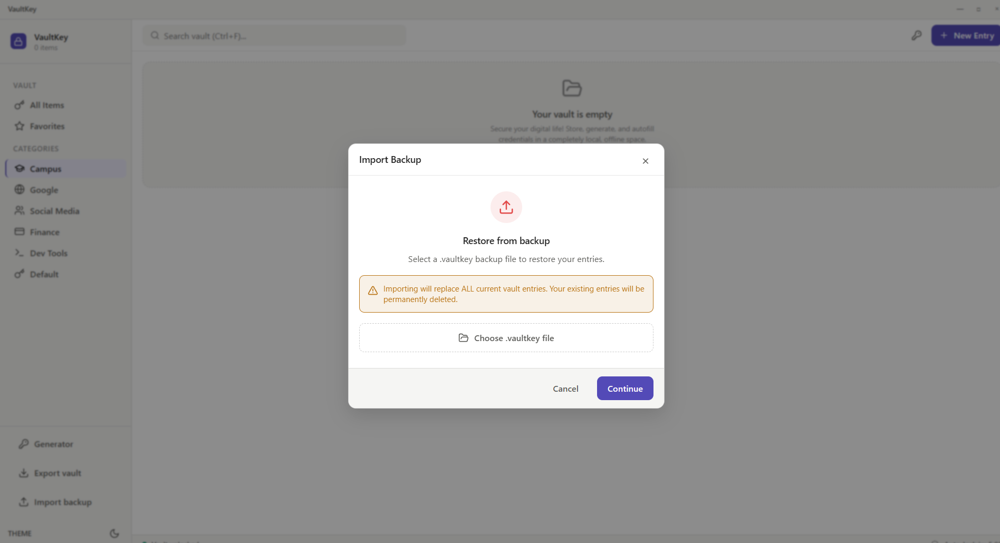

<div align="center">
  <!-- Replace with actual logo when available -->
  
  
  # VaultKey
  
  **A zero-knowledge local password manager built with Tauri + Rust + React**
  
  
  
  
  
  
</div>

VaultKey is a desktop password manager that stores all your credentials locally, encrypted with AES-256-GCM, with zero data ever leaving your machine.

## 💡 Why VaultKey

VaultKey was built to solve a simple problem: constantly resetting forgotten passwords is inefficient. Rather than trusting a third-party service with sensitive credentials, this project takes a different approach — store everything locally, encrypt everything client-side, and never send a byte to any server.

## ✨ Features

| Security | Usability |
|---|---|
| ✅ Zero-knowledge architecture | ✅ One-click copy with auto-clear |
| ✅ AES-256-GCM encryption | ✅ Password generator |
| ✅ Argon2id key derivation | ✅ Category organization |
| ✅ Encryption key never leaves RAM | ✅ Instant search |
| ✅ Auto-lock on idle | ✅ Dark mode |
| ✅ Clipboard auto-clear (30s) | ✅ Encrypted backup & restore |

## 🔐 Security Architecture

VaultKey uses a **zero-knowledge** design: the application never stores or transmits your master password or encryption key.

### How it works

1. **Master Password → Encryption Key**  
   Your master password is never stored. Instead, it is run through **Argon2id** (time_cost=3, mem_cost=64MB, parallelism=1) to derive a 32-byte encryption key (EK).

2. **Client-side Encryption**  
   Every vault entry is encrypted with **AES-256-GCM** before being written to disk. Each entry has a unique 12-byte random nonce — nonces are never reused.

3. **What's stored on disk**  
   Only ciphertext and the nonce are written to the database (`vault.db`). Opening the database without the master password reveals only unreadable binary blobs.

4. **Auto-lock**  
   After 5 minutes of inactivity, the EK is **zeroized from RAM** using the `zeroize` crate. The vault cannot be accessed until the master password is re-entered.

5. **Clipboard safety**  
   Copied passwords are automatically cleared from the clipboard after **30 seconds**.

### What VaultKey does NOT do
- ❌ Send data to any server
- ❌ Store your master password
- ❌ Keep decrypted passwords in memory beyond immediate use
- ❌ Log any sensitive values

## 🛠 Tech Stack

### Desktop Shell
- **[Tauri](https://tauri.app/)** — Rust-based desktop framework (lightweight, secure)

### Backend (Rust)
| Crate | Version | Purpose |
|---|---|---|
| `argon2` | 0.5 | Key derivation from master password |
| `aes-gcm` | 0.10 | AES-256-GCM encryption/decryption |
| `rand` | 0.8 | Cryptographically secure randomness |
| `rusqlite` | 0.29 | Local SQLite database |
| `zeroize` | 1.6 | Secure memory wiping on lock |

### Frontend (React/TypeScript)
| Package | Version | Purpose |
|---|---|---|
| React | 18.2 | UI framework |
| TypeScript | 5.0 | Type safety |
| Zustand | 4.4 | Session state management |
| Lucide React | 0.300 | Icons |
| React Router | 6.20 | Client-side routing |

## 📸 Screenshots

### Setup & Login



### Dashboard



### Entry Management



### Backup & Restore



## 🚀 Getting Started

### Prerequisites
- [Node.js](https://nodejs.org/) 18+
- [Rust](https://rustup.rs/) (stable)
- [Tauri CLI](https://tauri.app/v1/guides/getting-started/prerequisites)

### Development

```bash
# Clone the repository
git clone https://github.com/yourusername/vaultkey.git
cd vaultkey

# Install dependencies
npm install

# Run in development mode
npm run tauri dev
```

### Production Build

```bash
npm run tauri build
```

The installer will be generated in `src-tauri/target/release/bundle/`.

### First Launch
1. Open VaultKey.
2. Create your **master password** — choose something strong and memorable.
3. ⚠️ **There is no password recovery**. If you forget your master password, your data cannot be retrieved. This is by design.

## 💾 Backup & Restore

VaultKey supports encrypted vault backups via `.vaultkey` files.

**Export:** Sidebar → "Export vault" → choose a save location  
**Import:** Sidebar → "Import backup" → select `.vaultkey` file → enter backup's master password

The backup file is encrypted with the same master password — it cannot be read without it. Store your backup in a safe location: Google Drive, USB drive, or cloud storage.

> ⚠️ Importing replaces all current vault entries. This action cannot be undone.

## 🛡 Data & Privacy

- All data is stored **locally** in your OS app data directory.
- No accounts, no servers, no telemetry.
- VaultKey has **no internet connectivity** — it cannot make network requests.

**Data location:**
- Windows: `%APPDATA%\VaultKey\vault.db`
- macOS: `~/Library/Application Support/VaultKey/vault.db`
- Linux: `~/.local/share/VaultKey/vault.db`

## 📄 License

MIT License — see [LICENSE](LICENSE) for details.

---
